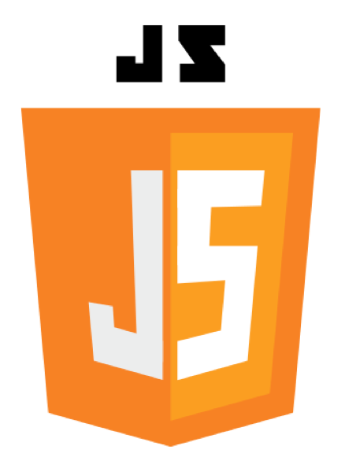

# JavaScript: Fundamentals 1

이 문서는 아주대학교 정보통신대학 소프트웨어과의 웹 시스템 설계 9. JavaScript: Fundamentals (1/2) 챕터에 기반하여 작성되었습니다.

작성자: 조민재

수업 목표: 자바스크립트가 무엇인지 파악하기.


## 소개

### 자바스크립트는 무엇인가?

**자바스크립트는 웹 브라우저를 위한 프로그래밍 언어로 개발되었다.**

JavaScript는 앞에서 배운 HTML(마크업 언어)과 CSS(스타일시트)와는 다르게 프로그래밍 언어입니다.


- 마크업 언어 (HTML)

  - 태그 등을 이용하여 문서나 데이터의 구조를 명기하는 언어. -> 구조, 정보

- 스타일 시트 (CSS)

  - 마크업 언어가 실제 표시되는 방법을 기술하는 언어. -> 스타일 (디자인)

- 프로그래밍 언어 (JavaScript)

  - 컴퓨터 시스템을 구동시키는 소프트웨어를 작성하기 위한 형식언어이다. -> 기능성 & 동적성

    

- JavaScript는 스크립트 언어입니다.

  - 스크립트 언어는 **독립된 시스템에서 작동하도록 특별히 설계된 프로그래밍 언어**입니다. **응용 프로그램과는 독립적**이고, **사용자가 직접 프로그램을 의도에 따라 동작시킬 수 있다**는 것입니다.  [참고한 사이트](https://wormwlrm.github.io/2018/10/03/What-is-the-difference-between-javascript-and-ecmascript.html)

    

- JavaScript는 인터프리트 언어입니다. 하지만 JIT (Just In Time) 컴파일러

  - 자바스크립트는 사전 컴파일 없이 런타임에 실행됩니다. 
  - 하지만 JIT 컴파일로, 프로그램을 실제 실행하는 시점에서 기계어로 번역하는 컴파일 기법을 사용한다고 합니다. [참고한 자료](https://ko.wikipedia.org/wiki/JIT_%EC%BB%B4%ED%8C%8C%EC%9D%BC)
  - (ex. 컴파일 언어: C, 인터프리트 언어: Python)

  

- JavaScript로 DOM을 건드려, HTML과 CSS 수정 가능 -> (이 점을 극대화시킨 것이 React에서 주로 사용하는 JSX? 가상 DOM을 이용해 문서 정보와 Style을 전부 javascript 파일 내에서 다룸.)  [참고한 사이트](https://d2.naver.com/helloworld/9297403#ch2)


### JavaScript의 역사

- 팀 버너스 리가 문서 공유를 원활히 하기 위해 월드 와이드 웹과 HTML 개발.

- 웹 브라우저 전쟁

  - 1st Browser War, between Netscape vs Internet Explorer 2.0 (JavaScript vs JScript)

    - 최초의 획기적인 상용 웹브라우저 Netscape 탄생. (닷컴버블의 발단)

      

      

      사진출처: [1991년, 인터넷의 발명과 인터넷 브라우저 전쟁](https://www.youtube.com/watch?v=taJV5cigzNY)

    - 뒤따라 윈도우 95+에 기본 탑재된 인터넷 브라우저 탄생

    - Netscape(현재의 Mozilla)에서 JavaScript 개발. 

      - (이때 마케팅의 일환으로, 사람들에게 쉽게 인식되기 위해서 Java의 이름을 따온 것임.)

    - 윈도우에서도 JScript 개발

    - PC 점유율의 대부분이었던 윈도우였기에,  Netscape를 몰아내고 Internet Explorer 가 웹 브라우저 대부분의 점유율 차지하게 됨. (약 90%) -> 시장 독점.

    - Netscape는 **ECMA 표준**에 자신들이 개발한 **JavaScript**의 제어권을 넘기고, 협회는 ECMAscript라는 이름으로 JavaScript 표준을 공식화하였음.

    - 이제 ECMAScript 표준 아래에서 똑같아짐. 


  

  

  - 2nd Browser War

    

    

    

    - 크롬 웹 브라우저의 등장, Internet Explorer의 몰락. 

      - 가장 큰 이유는 Google사의 Android OS의 등장. -> 윈도우 점유율을 따라 인터넷 익스플로러 점유율이 늘어난 것처럼, 크롬도 마찬가지였음.

        

        

      - 또 다른 이유는 크롬 브라우저의 성능. Google이 JavaScript의 속도를 획기적으로 빠르게 만든 V8 엔진을 개발함 (훗날 이에 기반하여 Node.js 탄생하게 됨.)

        

    - HTML5 표준


참고: 

[생활코딩 WEB2 - JavaScript 수업소개](https://opentutorials.org/course/3085)

[생활코딩 WEB2 - Node.js 수업소개](https://opentutorials.org/course/3332)

[Javascript와 JScript : 차이점은 무엇입니까?](https://www.greelane.com/ko/%EA%B3%BC%ED%95%99-%EA%B8%B0%EC%88%A0-%EC%88%98%ED%95%99/%EC%BB%B4%ED%93%A8%ED%84%B0-%EA%B3%BC%ED%95%99/javascript-and-jscript-whats-the-difference-2037681/)


-------- 사실 여기까지는 별로 안 중요함 --------


### JavaScript 의 역할



- style을 적용하기 위해, dynamic하게 content를 바꾸기

  -> (페이지에 새로운 HTML 내용을 넣는다던가 , 기존 콘텐츠를 바꾼다던가, 동적으로 스타일을 바꾸는 등)

- Browser에 사용자가 적용하는 event 를 처리하기

  -> (마우스 클릭, 마우스 포인터 움직임, 특정 키 등에 대한 사용자 행동 등에 반응하는 등)

- 비동기처리, 즉 **Ajax**(Asynchronous JavaScript and XML) 사용

  -> 사용자가 요청을 보내, 서버로부터 새로운 웹페이지가 반환되면 페이지 일부만을 갱신하는 것이 Ajax. (예를 들면 페이스북 페이지) [참고한 사이트](https://poiemaweb.com/js-ajax) 


## JavaScript 기초 문법 

### JavaScript를 사용하는 방법

- 웹브라우저(크롬) 개발자모드
  - 크롬에서 F12 누르고 console 탭에서 사용.


- HTML 파일에 삽입
  - script 태그는 브라우저의 html 문서 렌더링을 멈추게 하므로 웬만하면 body 태그가 닫히기 직전에 호출 할 것

```html
<!DOCTYPE html>
<html>
<body>
    <input type="button" id="hw" value="Hello world" />
    <script type="text/javascript"> <!-- html 파일 내에서 스크립트 작성 -->
    	alert("In html file");
    </script>
    
    <script type="text/javascript" src="./파일명.js"></script> <!-- body 태그 닫히기 직전에 호출 -->
</body>
</html>
```


- Node.js

```shell
node ./index.js
```


### 주석 (Comments)

주석은 C++이나 Java와 동일합니다.

```javascript
// 한줄 주석
// console.log 함수는 다른 언어의 print와 비슷한 기능을 수행하다.

console.log(1 + 1); // 결과는 2 이다.
console.log(0.3 + 0.03); // 결과는 0.32999999999999996 이다. 실수형 연산은 컴퓨터가 완벽히 해낼수 없으므로, 반올링을 활용하자.

/* 
여러줄 주석
시진핑 주석
*/
```


### 변수와 상수 (Variable and Constant)

- 변수 (Variable) : 이름이 붙은 값으로, 값이 언제든지 바뀔 수 있음 (let or var)

  ```javascript
  let bookName = '스튜어트 미분적분학';
  let author = 'James Stewart';
  let price = 42000; // 교보문고 기준
  
  console.log(price) // 출력 결과는 42000
  
  price = 21000; // 반값 세일!
  
  console.log(price) // 출력 결과는 21000
  ```

  - ES6부터는 let을 변수 지정할때 사용하도록 권장됨. 

  - let은 처음에 선언한 형으로만 값 담을 수 있음. var는 그렇지 않음.

    (ex.  let은 처음에 숫자형으로 선언하면 숫자형으로만 변환 가능, var은 처음에 숫자형으로 선언해도 문자형 등으로 변환 가능.)


- 상수 (Constant) : 이름이 붙은 값이며, 한 번 할당한 값을 바꿀 수 없음 (ES6에서 추가됨)

  ```javascript
  const NEVER_CHANGE = 525;
  NEVER_CHANGE = 10; // 에러 발생: Uncaught TypeError: Assignment to constant variable.
  ```

    - 런타임 중, 변경되면 안되는 값을 상수로 지정함.
    - **대문자**와 언더바(_)로 이름 붙여야 하는 규칙이 있음.

  

  

  

  ------------- 여기서 문제 1. ---------------

  다음중 ES6 (ECMA Script6)에서 권고하는 JavaScript의 변수 선언 코드는 무엇인가.

  1. var 변수명;
  2. let 변수명;
  3. const 변수명;
  4. console.log 변수명;

  

  [정답](2번)

  


### 식별자 (변수명, 상수명 및 함수명 등)

- **식별자**는 간단하게 그냥 이름이라고 보면 됩니다.

- 변수와 함수에 이름을 붙일때 사용함.

- 식별자의 첫 기호는 반드시 문자나, 언더바(_), 달러 사인($)으로 시작해야 합니다. 이후부터는 문자, 숫자, 밑줄 또는 달러 기호일 수 있습니다.

- **예약어**로 이미 지정되어 있는 이름은, 식별자로 사용할 수 없습니다.

  ```
  예시) break delete function return typeof case do if switch var catch else in this void continue false instanceof throw while debugger finally new true with default for null try let const 
  ```

- 식별자 이름 규칙

  식별자 이름은 띄어쓰기를 할 수가 없습니다. 그래서 여러 단어가 포함된 식별자 이름을 붙이려면 "bookPrice" 이런 식으로 띄어쓰기 없이 사용해야 합니다. 

  - 카멜 표기법 (Camel case)

    ```javascript
    // 첫 단어 제외하고, 각 단어가 시작될 때마다 대문자로 시작.
    let bookPrice = 42000; // book + price
    let bookAuthor = 'James Stewart'; // book + author
    ```

    - C, Java 등 대부분의 언어에서 이러한 코드 스타일로 사용하는 것으로 알고 있습니다. 필수는 아니지만 이런 식으로 사용하길 권장합니다.

    - 식별자 이름에서 한 단어 뒤에 새로운 단어가 올때, 뒤에 오는 단어의 첫문자를 대문자로 표기하면 됩니다.

    - (JavaScript 대부분의 코드에서 이 방식 사용하는 것 같음.)

      

  - 스네이크 표기법 (Snake case)

    ```javascript
    // 각 단어 사이마다 언더바(_)를 넣어줌
    let book_price = 42000; // book + price
    let book_author = 'James Stewart'; // book + author
    ```

    - 이 방식은 파이썬에서 주로 사용되는 것으로 알고 있습니다.
    
      
  
  - 또 다른 내용
  
    - 식별자 중 클래스(Class)만 첫문자를 대문자로 시작할 수 있다.
    - 하나 또는 두 개의 언더바( _ )로 시작하는 식별자는, 종종 특수 변수 또는 "내부" 변수를 나타내기 위해 사용됩니다. 고유한 특수 변수 카테고리를 생성할 필요가 없는 경우 밑줄로 변수 이름을 시작하지 마십시오.
    - jQuery를 사용할 때 달러($) 기호로 시작하는 식별자는 일반적으로 jQuery로 포장된 개체를 참조합니다.


---------- 여기서 문제2. 아래 변수를 지정하는 코드 중 실행하면 오류가 나는 것은? ----------

```javascript
let mouse_sum = 6;
let func = 7; // 2번
let function = 8; // 3번
let mouseSum = 9; // 4번
```

[정답](3번)


###  리터럴 (Literals)

```javascript
const num = 1; // num은 상수이고 1은 10진수 정수 리터럴입니다.
let str = '이름'; // str은 변수이고 '이름'은 문자열 리터럴입니다.
const array = []; // [] = 배열 리터럴.
const object = {}; // {} = 객체 리터럴.
```

- 문자 그대로의 값
- 소스 코드의 고정된 값을 대표하는 용어

- 변수에 할당되면 변수가 가지는 "값"이 됨

  [참고한 사이트](https://jee-goo.tistory.com/entry/%EB%A6%AC%ED%84%B0%EB%9F%B4Literal%EC%9D%B4%EB%9E%80)

  ```javascript
  12 // The number twelve
  1.2 // The number one point two 
  "hello world" // A string of text
  'Hi' // Another string
  true // A Boolean value
  false // The other Boolean value
  null // Absence of an object
  ```


### JavaScript의 자료형들

- 원시 자료형 (Primitive types)  - 불변의 (immutal)

  ex. 숫자 5는 항상 숫자 5이며, "ajou"와 "ajou" + "software"로 만들어진 "ajousoftware"는 다른 문자열입니다.

  ​	① numbers(숫자) 

  ​	② strings of text (문자열: known as strings) 

  ​	③ boolean truth values 

  ​	④ null 

  ​	⑤ undefined 

  ​	⑥ Symbol


- 객체 타입 (Object types)

  - 객체(Object)란 물리적으로 존재하거나 추상적으로 생각할 수 있는 것 중에서 자신의 속성을 가지고 있고 다른것과 식별 가능한 것을 말합니다. [참고한 사이트](https://jwprogramming.tistory.com/121)

  - 객체 내의 함수는 메소드라고 부름.

    ```javascript
    var person = {
      name: 'Bob',
    age: 32,
      gender: 'male',
    interests: 'music',
        
      bio: function() {
        alert(this.name + ' is ' + this.age + ' years old. He likes ' + this.interests);
      },
        
      greeting: function() {
        alert('Hi! I\'m ' + this.name[0] + '.');
      }
        
    };
    
    console.log(person.name); // 객체 내 
    person.bio(); // 객체 내 메소드 실행해 봄.
    ```
  
    [참고한 사이트](https://developer.mozilla.org/ko/docs/Learn/JavaScript/Objects/Basics)
  
  - **내장 객체** (built-in objects)
  
    - **배열**은 특별한 종류의 객체이다. 순서를 가진 값들의 집합체.
    - **Date**, RegExp, Map(& WeakMap), Set (& WeakSet) 
    - **Boolean, 문자열( String ), Number Objects:** primitive type에 대응하는 객체 타입
  
  - **Literal syntax: curly braces**
  
    ```javascript
    const obj = {};
    obj.color = “yellow”;
    obj[“not an identifier”] = 3;
    ```


### 기본 자료형: 숫자형

- 숫자형 (Numbers)

  - JavaScript 는 하나의 numeric data type 만을 가짐. (전부 double 형)

    (IEEE-764 double-precision floating-point 기반) 

  - Numeric Literals :

    - 10진수(decimal), 2진수(binary), 8진수(octal), 16진수(hexadecimal)

  - 양/음 무한대: Infinity, -Infinity 와 NaN (Not a Number)

    - these are not technically numeric literals, but they result in numeric values

```javascript
let count = 10; // integer literal; count is still a double
const blue = 0x0000ff; // hexadecimal (hex ff = decimal 255)
const umask = 0o0022; // octal (octal 22 = decimal 18)
const roomTemp = 21.5; // decimal
const c = 3.0e6; // exponential (3.0 × 10^6 = 3,000,000)
const e = -1.6e-19; // exponential (-1.6 × 10^-19 = 0.00000000000000000016)
const inf = Infinity;
const ninf = -Infinity;
const nan = NaN; // "not a number"
```


### 기본 자료형: 문자열, 이스케이핑

- 문자열 (String)

  - 문자(character)의 연속

  - Unicode text

    - Unicode is a computing industry standard for representing text data, and includes code points for every character or symbol in most known human languages

  - 따옴표 (' ')나 큰 따옴표 (" "), 혹은 백틱 (``)을 사용합니다.

- Escaping (with backslash \)

  - Need a method of escaping characters not to take it as string termination 
    - For example, use quotes(“ “) in string

  ```javascript
  const dialog = "Sam looked up and said "don't do that!" to Max."; // error
  const dialog1 = "He looked up and said \"don't do that!\" to Max.";
  ```


### 기본 자료형: Special Character, Template Strings

- Special Characters

  ```javascript
  '\n' Newline (a line feed character: ASCII/Unicode 10): Linux newline // 한 줄 띄어쓰기
  '\r' Carriage return (ASCII/Unicode 13): MacOS use this for a newline // 커서 맨 앞에 위치
  '\t' Tab (ASCII/Unicode 9) // tab 한번 누르기
  ```

  - WinOS uses \r\n for a newline

- Template strings (string interpolation)

  - From ES6

    ```javascript
    let currentTemp = 19.5;
    // 00b0 is the Unicode code point for the "degree" symbol
    const message = `The current temperature is ${currentTemp}\u00b0C`;
    ```

  - Inside a string template, the dollar sign($) becomes a special character if it’s followed by a value3 wrapped in curly braces{ }, that value is inserted into the string.


### 기본 자료형: boolean

- Boolean has only two possible values: false and true

  - Use value without quotes(“ “)

    ```javascript
    let heating = true;
    let cooling = false;
    ```


### 기본 자료형: Symbol (new in ES6)

- Symbol is a new data type representing unique tokens. Once you create a symbol, it is unique: it will match no other symbol.

  - symbols are like objects (every object is unique). 

  - But, it is primitives and extensible. 

  - 다른 identifier와 혼동되어서는 안되는 unique한 identifier를 필요로 하는 경우 사용

    ```javascript
    const RED = Symbol();
    const ORANGE = Symbol("The color of a sunset!");
    RED === ORANGE // false: every symbol is unique
    ```


### 기본 자료형: null and undefined

- null and undefined

  - null: the absence of a value (declare and assign “null”)
    - Null has only one possible value (null) 
    - typeof null is “object” -> typically indicate “no value” for numbers, strings, and objects 
    - For programmer

  - undefined: the absence of a value & not been initialized (declared, but no-assignment)

    - Undefined has only one possible value (undefined) 
    - typeof undefined is “undefined” <- undefined is read-only and global variable \
    - For JavaScript

    ```javascript
    let currentTemp; // implicit value of undefined
    const targetTemp = null; // target temp null -- "not yet known"
    currentTemp = 19.5; // currentTemp now has value
    currentTemp = undefined; // currentTemp appears as if it had never
    // been initialized; not recommended
    ```


### 기본 자료형: 객체 (Objects)

- Objects

  - Container of contents (properties)
    - Objects can represent multiple or complex values, and can change over their lifetime.
    - Syntax: curly brackets { }
  - Properties is a pair of a name(a key) and value

- Objects can also contain functions

  ```java
  sam3.speak = function() { return "Meow!"; };
  sam3.speak(); // "Meow!"
  ```

- Delete property

  ```javascript
  delete sam3.speak // the speak function is removed
  ```

  

```javascript
// An object is a collection of name/value pairs, or a string to value map.
const book = { // Objects are enclosed in curly braces.
topic: "JavaScript", // The property "topic" has value "JavaScript".
useful: true // The property "fat" has value true.
}; // The curly brace marks the end of the object.
// Access the properties of an object with . or [ ]:
book.topic // => "JavaScript"
book[“useful"] // => true: another way to access property values.
book.author = “Ethan"; // Create new properties by assignment.
```


### 기본 자료형: 배열 (Arrays)

- 배열 (Arrays)

  - 배열의 인덱스(key)는 연속적인 정수로 이뤄져있고, 0부터 시작한다.
  - 문법: 대괄호 [ ]를 사용한다.
  - Properties of Array
    - Array size is not fixed; you can add or remove elements at any time. 
    - Arrays are not homogeneous; each individual element can be of any type. 
    - Arrays are zero-based. That is, the first element in the array is element 0. 

  - Arrays have a property length, which returns the number of elements in the array:

    ```javascript
    const arr = ['a', 'b', 'c'];
    arr.length; // 3
    ```

    ```javascript
    const arr = ['a', 'b', 'c'];
    // get the first element:
    arr[0]; // 'a'
    ```

    

```javascript
// JavaScript also supports arrays (numerically indexed lists) of values:
let primes = [2, 3, 5, 7]; // An array of 4 values, delimited with [ and ].
primes[0] // => 2: the first element (index 0) of the array.
primes.length // => 4: how many elements in the array.
primes[primes.length-1] // => 7: the last element of the array.
primes[4] = 9; // Add a new element by assignment.
primes[4] = 11; // Or alter an existing element by assignment.
let empty = []; // [] is an empty array with no elements.
empty.length // => 0
// Arrays and objects can hold other arrays and objects:
let points = [ // An array with 2 elements.
{x:0, y:0}, // Each element is an object.
{x:1, y:1}
];
let data = { // An object with 2 properties
trial1: [[1,2], [3,4]], // The value of each property is an array.
trial2: [[2,3], [4,5]] // The elements of the arrays are arrays.
};
```


### 자료형(데이터형) 변환

- 문자열을 숫자로 변환

  ```javascript
  const numStr = "33.3";
  const num = Number(numStr); // this creates a number value, *not*
  // an instance of the Number object
  ```

  ```javascript
  const a = parseInt("16 volts", 10); // the " volts" is ignored, 16 is
  // parsed in base 10
  const b = parseInt("3a", 16); // parse hexadecimal 3a; result is 58
  ```

- 숫자를 문자열로 변환

  ```javascript
  const n = 33.5;
  n; // 33.5 - a number
  const s = n.toString();
  s; // "33.5" - a string
  ```


----------- 여기서 마지막 문제 3번. 다음 중 객체인 자료형을 고르시오. ------------


